# Report - Lab6 - Microservices
## 1. The two microservices are running and registered
Registration service running 
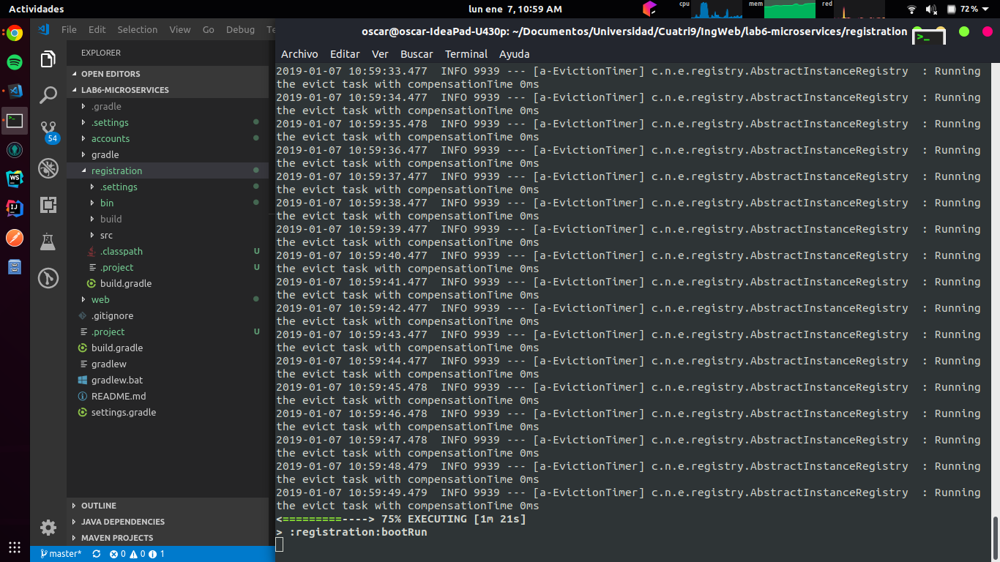
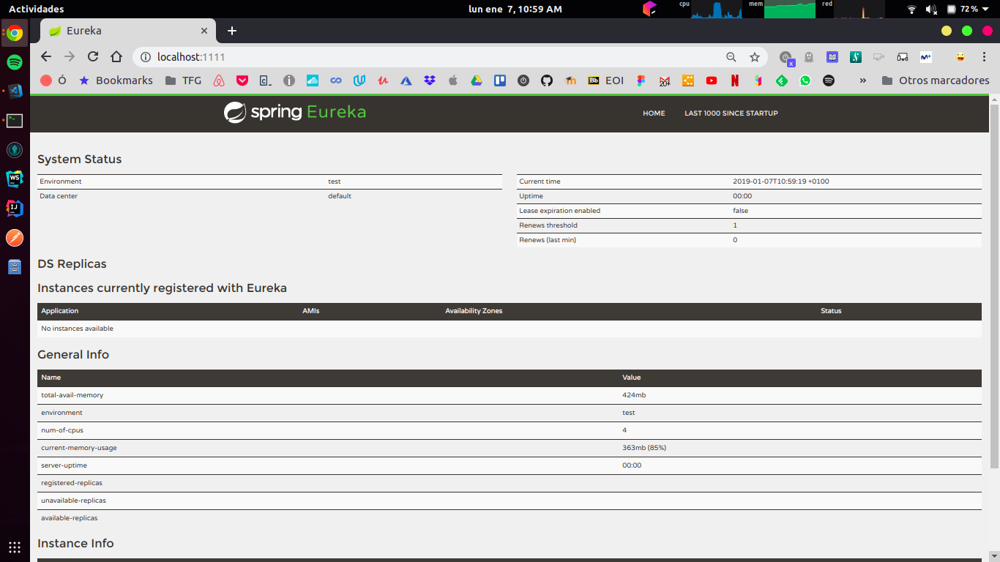

Accounts microservice running
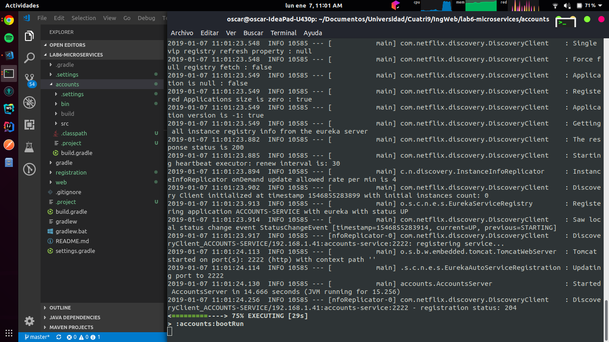
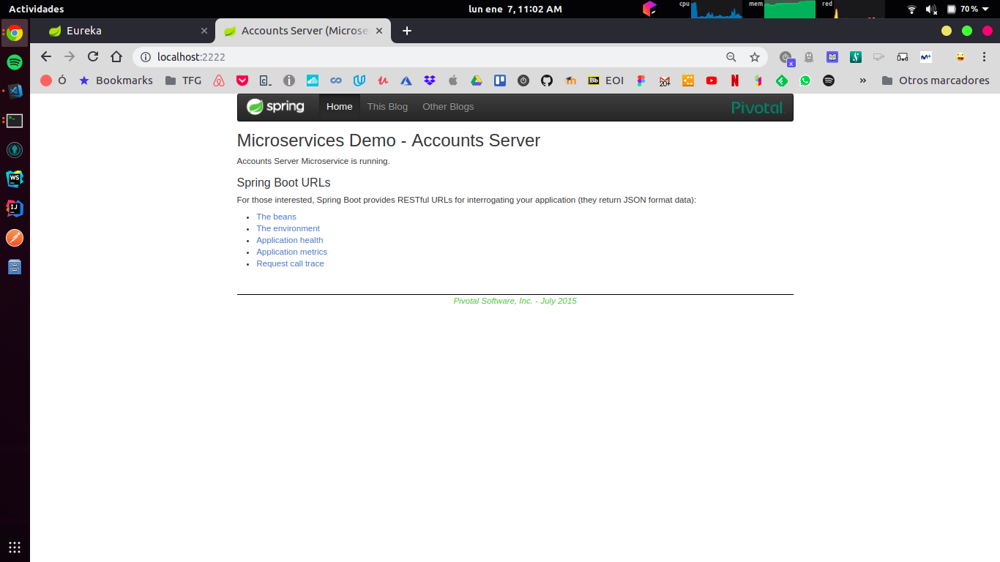
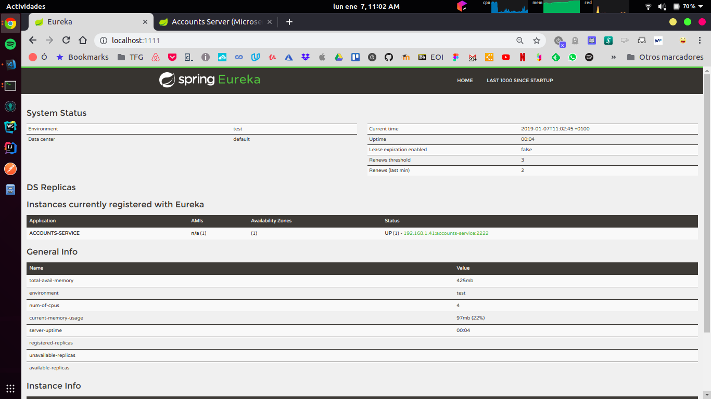

Web microservice running
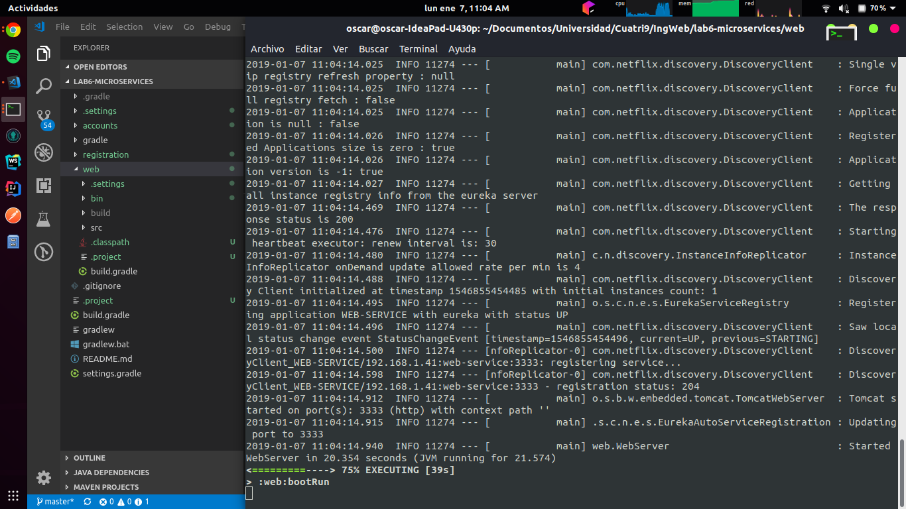
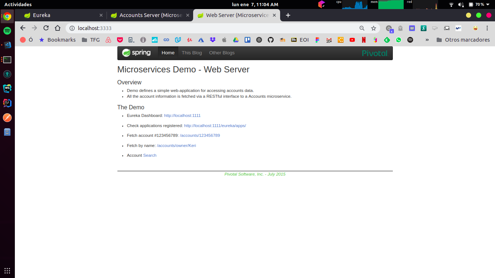
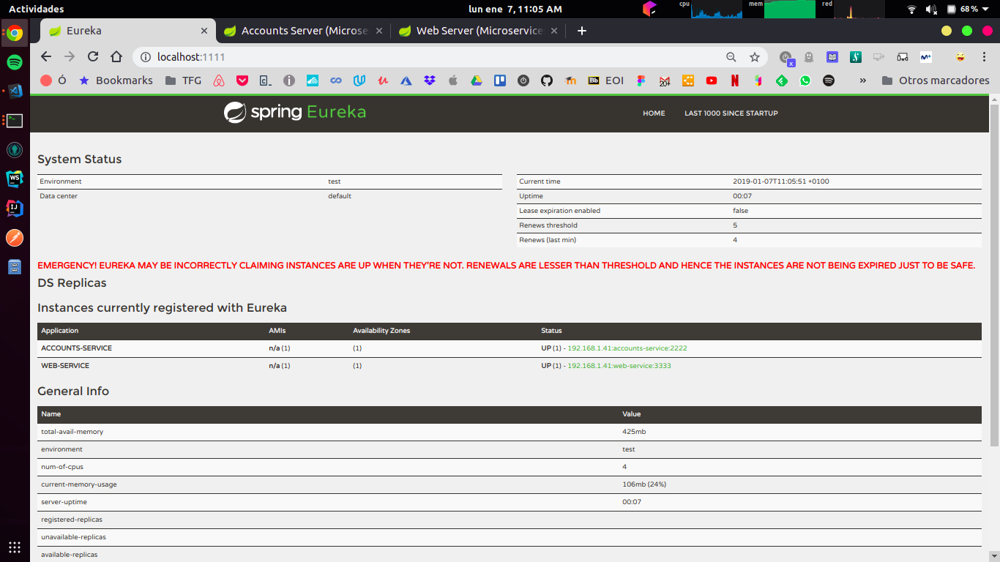

Both microservices running
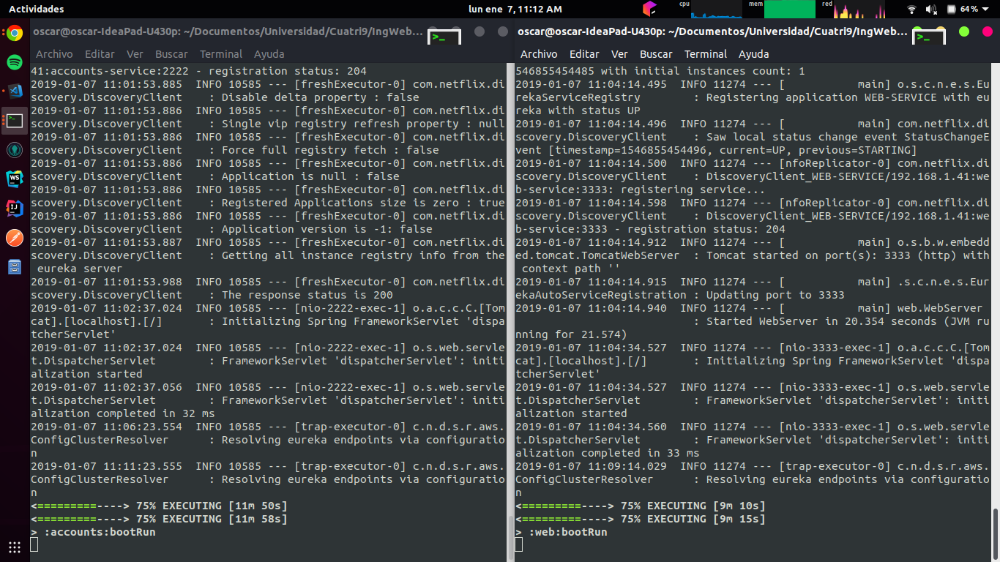

## 2. The service registration service has the two microservices registered

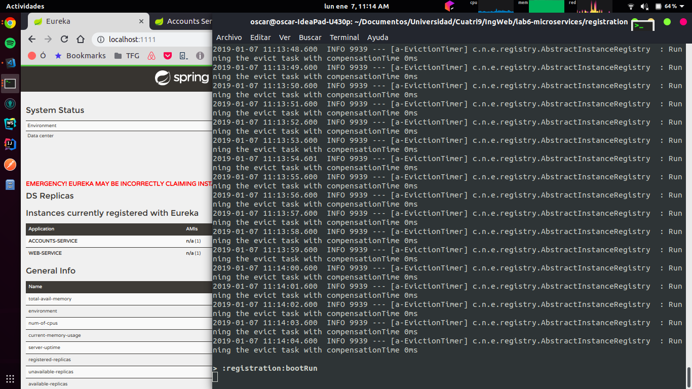

## 3. A second account microservice is running in the port 4444 and it is registered

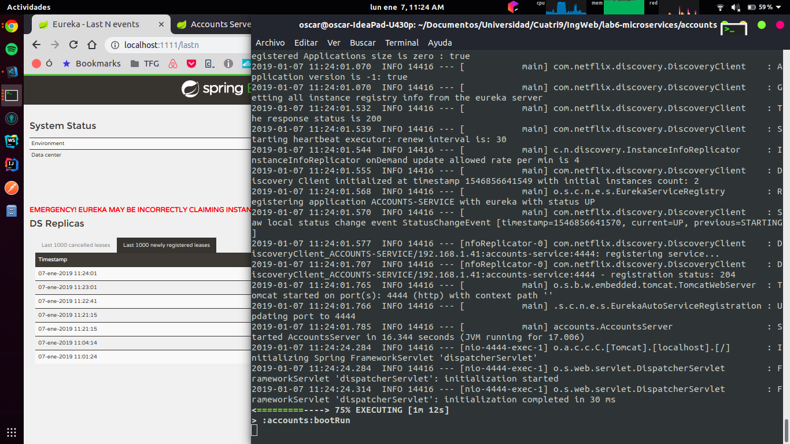

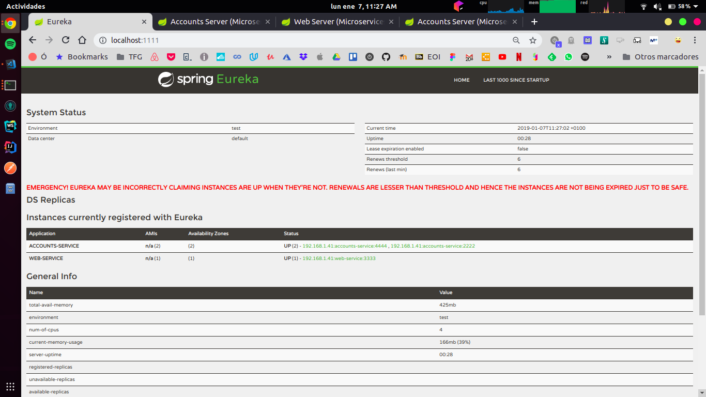

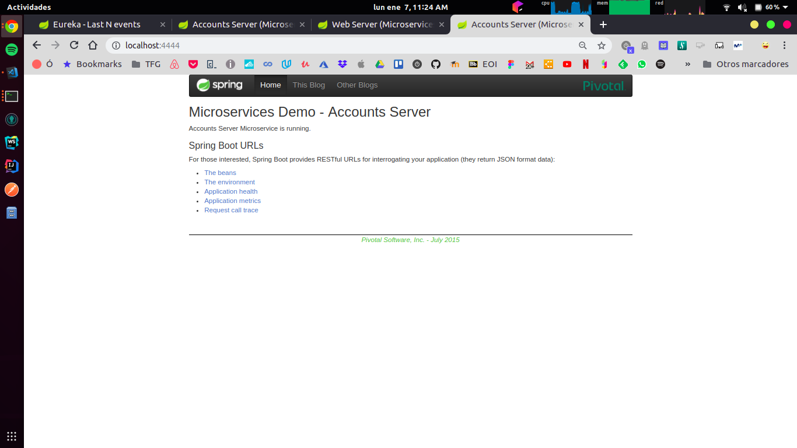

## 4. A brief report describing what happens when you kill the microservice with port 2222

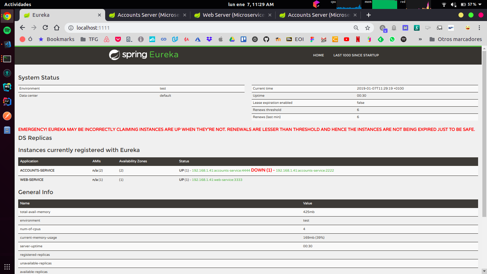

After killing the microservice with port 2222, if a user try to access to the accounts service, there are some seconds when the provided service is unaccessible and it returns a connection refused error.

A few seconds later, when the user try to access again, the Eureka registration service provide the connection details of another active instance of the account service, the port 4444.